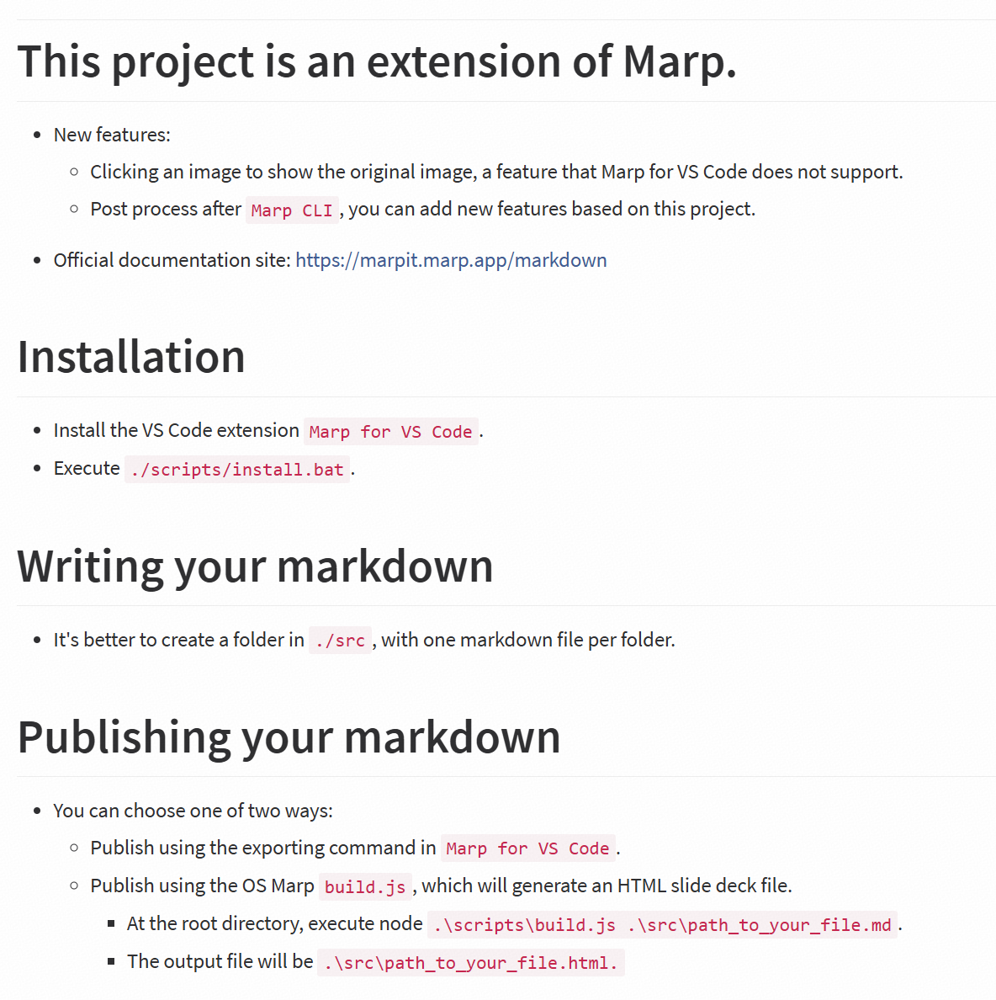

# Expample
## Marp with post process
### target HTML slide deck

---
#### Slide Title

## Support Image Modal:
- Click Image, Open the Modal
    - style1
        - style2

- Use `HTML img`

---
#### Slide Title

## Video:
- Support Videos
    - Use `HTML DIV`

    

        <video src="video1.mp4" width="320" height="240" controls></video>
        
video1

    

    

        <video src="video2.mp4" width="320" height="240" controls></video>
        
video2

    

